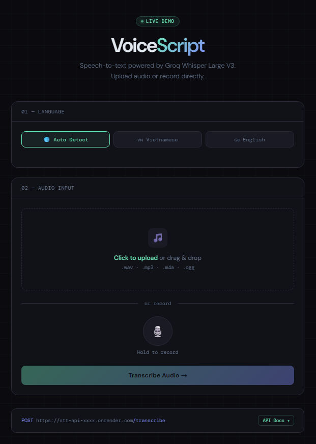

# 🎙️ Speech-to-Text API

A production-ready REST API that converts speech to text using **Groq Whisper Large V3** — supporting Vietnamese, English, and auto language detection.

🌐 **[Live Demo](https://sickked-c.github.io/STT-API/)** · 📖 **[API Docs](https://stt-api-lpu3.onrender.com/docs)**

---

## 🖼️ Demo



---

## ✨ Features

- 🌐 Auto language detection (VI / EN)
- 📂 Upload audio files (.wav, .mp3, .m4a, .ogg)
- 🎙️ Record directly in the browser
- ⚡ Powered by Groq Whisper Large V3 (fast & accurate)
- 🔒 Input validation & error handling
- 🐳 Deployable via Python runtime or Docker

---

## 🛠️ Tech Stack

| Layer | Technology |
|-------|-----------|
| API Framework | FastAPI |
| Speech Model | Groq Whisper Large V3 |
| Language | Python 3.10 |
| Deploy | Render |
| UI Demo | GitHub Pages |

---

## 🚀 API Usage

### Transcribe Audio

```bash
POST /transcribe
```

**Parameters:**
- `file` — Audio file (.wav, .mp3, .m4a, .ogg)
- `language` — `vi`, `en`, or `auto` (default: `auto`)

**Example:**

```bash
curl -X POST https://stt-api-lpu3.onrender.com/transcribe \
  -F "file=@audio.wav" \
  -F "language=auto"
```

**Response:**

```json
{
  "filename": "audio.wav",
  "language": "auto",
  "transcription": "Hello, this is a test."
}
```

---

## 📦 Installation

```bash
# 1. Clone repo
git clone https://github.com/Sickked-C/STT-API.git
cd STT-API

# 2. Create virtual environment
python -m venv .venv
.venv\Scripts\activate       # Windows
source .venv/bin/activate    # Mac/Linux

# 3. Install dependencies
pip install -r requirements.txt

# 4. Create .env file
cp .env.example .env
# Add your GROQ_API_KEY

# 5. Run
uvicorn main:app --reload
```

Visit **http://localhost:8000/docs**

---

## ⚙️ Environment Variables

```env
GROQ_API_KEY=your_groq_api_key_here
```

Get your free API key at **[console.groq.com](https://console.groq.com)**

---

## 📁 Project Structure

```
.
├── main.py          # FastAPI app & Groq integration
├── index.html       # Web UI demo
├── requirements.txt
├── .env.example
└── README.md
```

---

## 🗺️ Roadmap

- [x] Vietnamese & English transcription
- [x] Auto language detection
- [x] Web UI demo
- [ ] Batch transcription
- [ ] Speaker diarization

---

## 📄 License

MIT License
